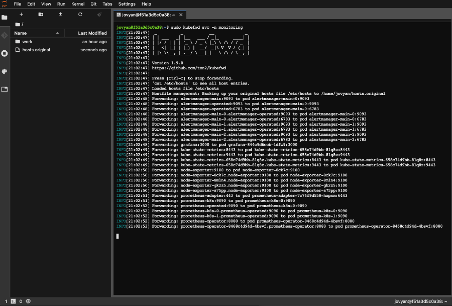
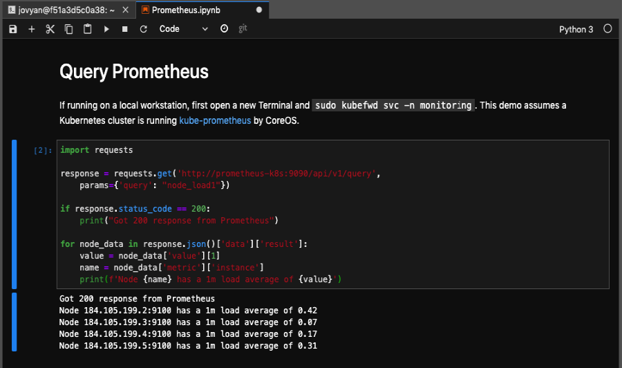

# DataLab
Custom [JupyterLab] container for the txn2, apk8s and RevolveNet platforms.

DataLab is a large [Jupyter Notebook] container assembled for use as a central IDE within a data platform. [JupyterHub] provisions DataLab and uses a Kubernetes Service Account with a well defined RBAC configuration. 


Read more about [JupyterHub on Kubernetes].

## Local Workstation / GPU Station

DataLab is a feature-packed Data Science, Machine Learning and IoT IDE  in-cluster or on local workstations. **DataLab contains [kubefwd], allowing developers and data scientists to work locally with APIs and data sources exposed through Kubernetes services and port-forwarded directly into the [JupyterLab] environment.** 

```bash 
docker run --rm --name datalab -p 8888:8888 \
  -v "$(pwd)":"/home/jovyan/work" \
  -v "$HOME/.kube/":"/home/jovyan/.kube/" \
  --user root \
  -e GRANT_SUDO=yes \
  -e JUPYTER_ENABLE_LAB=yes -e RESTARTABLE=yes \
  txn2/datalab:v0.0.1
```






## Packages

Datalab contains the following utilities:
- [git](https://git-scm.com/)
- [kubectl]
- [kubefwd] (for local workstations)

Kernels:
- [Python 3](https://www.python.org/)
- [Octave 4.2.2](https://www.gnu.org/software/octave/)
- [Julia 1.1.1](https://julialang.org/)
- [R 3.6.1](https://www.r-project.org/)

Python Libs:
- [rubix](http://docs.nurtch.com/en/latest/rubix-library)
- [python-gitlab](https://python-gitlab.readthedocs.io/en/stable/)
- [jupyterlab-git](https://github.com/jupyterlab/jupyterlab-git)
- [scipy](https://www.scipy.org/)
- [numpy](https://www.numpy.org/)
- [pandas](https://pandas.pydata.org/)
- [scikit-learn](https://scikit-learn.org/stable/)
- [matplotlib](https://matplotlib.org/)
- [tensorflow](https://www.tensorflow.org/)
- [torch](https://pytorch.org/)
- [torchvision](https://pytorch.org/docs/stable/torchvision/index.html)
- [fastai](https://www.fast.ai/)
- [octave_kernel](https://github.com/Calysto/octave_kernel)
- [paho-mqtt](https://www.eclipse.org/paho/clients/python/docs/)
- [web3](https://web3py.readthedocs.io/en/stable/)
- [py-solc](https://github.com/ethereum/py-solc)


## Build

```bash 

```
[kubefwd]: https://github.com/txn2/kubefwd
[kubectl]: https://kubernetes.io/docs/reference/kubectl/overview/
[Jupyter Notebook]: https://jupyter.org/
[JupyterHub]: https://jupyterhub.readthedocs.io/en/stable/
[JupyterHub on Kubernetes]: https://zero-to-jupyterhub.readthedocs.io/
[JupyterLab]: https://jupyterlab.readthedocs.io/en/stable/